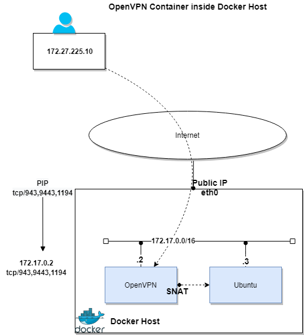
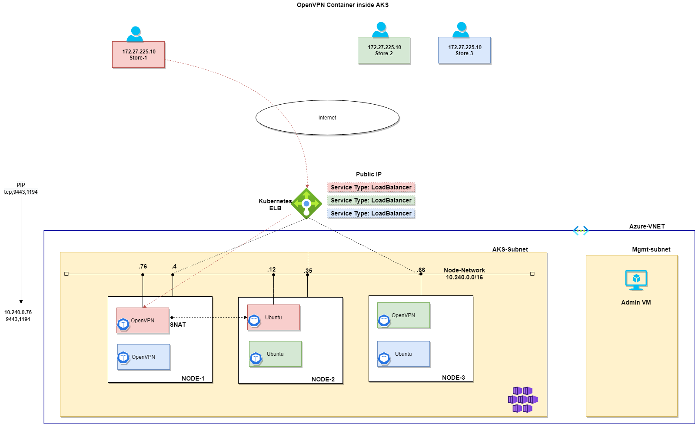

# Purpose

Run Openvpn as a container in Azure AKS environment

# Architecture diagram

## Using Docker Host

## Kubernetes Deployment

## Design Requirements

A multi-tenant kubernetes cluster with openVPN container deployed per namespace with remote access to corresponding on-premises stores.

## Prerequisites

1. Familiarity with Docker and Kubernetes networking
2. Linux VM in Azure with Public IP as a Docker Host
3. AKS Cluster in Azure
4. Docker Desktop Running Docker + Kubernetes and WSL(This is optional if you are using #3 and #4. This option can be use for quick testing)

## Project tasks breakdown

Note: Steps 1-6 involves manual steps to prove out end-to-end network connectivity for this POC design. Starting task#6 we will introduce automation.

1. [Run Openvpn Access Server(openvpn-as) container on a docker host](docker/README.md)
2. [Configure and test end-to-end connectivity with Openvpn Client](openvpn/setup.md)
3. [Build docker-compose file](docker/README.md)
4. [Generate k8s manifest files using kompose](aks/README.md)
5. [Run the container in AKS](aks/README.md)
6. [Test outbound access from AKS pod -> OpenVPN Client for connections initiated from AKS side](aks/README.md)
7. Configure AKS pod as an OpenVPN client
8. Build a secure custom image for OpenVPN server (not Access Server)
9. Build automation and devops practice
10. Secure management access
11. Kubernetes namespace security with Azure Policy
12. AKS pod as a OpenVPN client

13. ## Contributors

Thank you Tommy Falgout (lastcoolnameleft) for the contributions

## Acknowledgments
